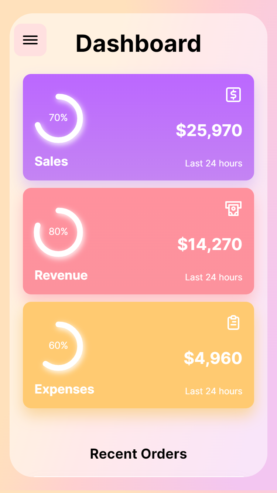
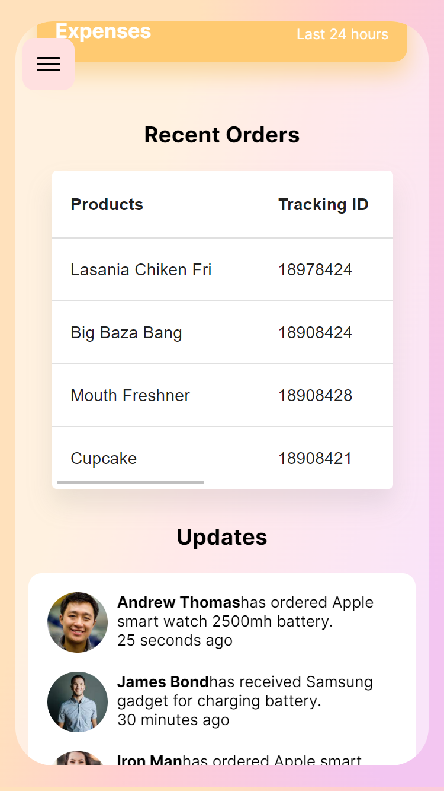
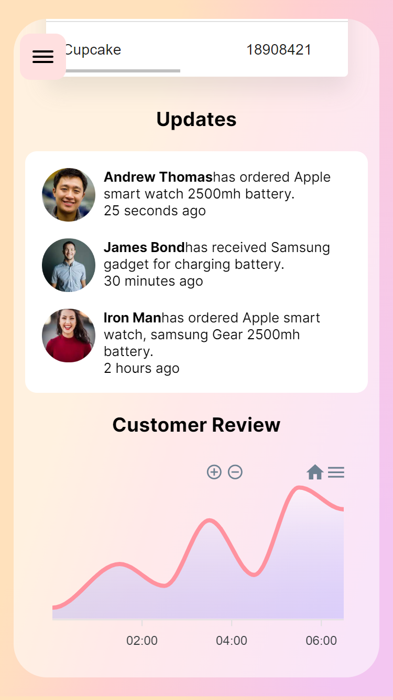
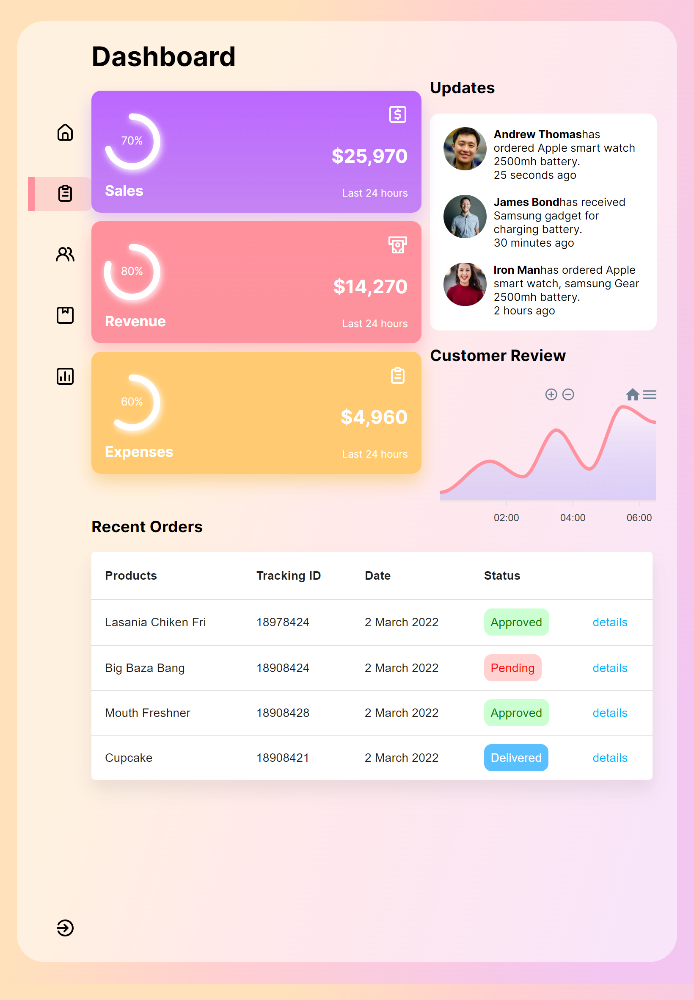
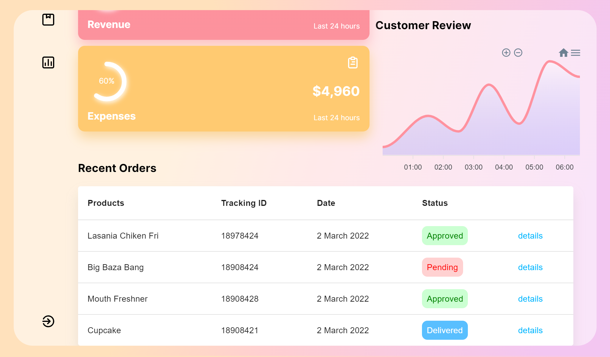
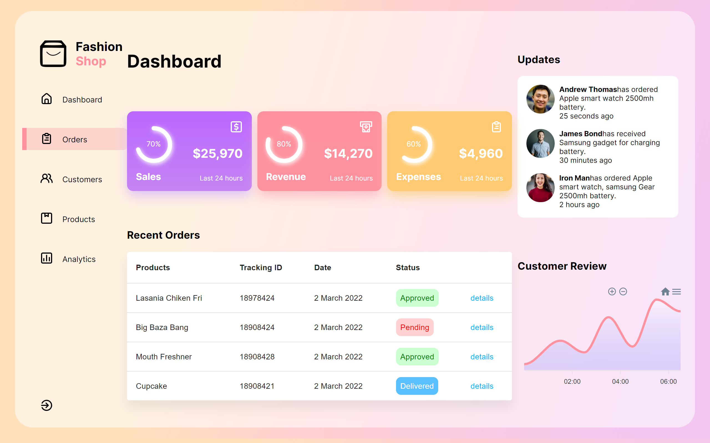

# DASHBOARD

Este Dashboard es realizado con el fin visualizar data importante de nuestros negocios, mejorando asi el manejo de los mismos. Este proyecto se realizo con React, utilizando Apexcharts para las graficas, Motion para las animaciones y Material UI para las tablas. Es un proyecto completamente responsive, pensando el su uso desde diferentes dispositivos.

## Diseño Responsive

### Phone

### Tablet

### Laptop

### Desktop

## Instalación

npm Install

## Corre Proyecto

npm run start
